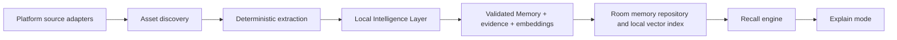

# Architecture

## Guiding principle

Android owns original files and source content. Memora owns only source references,
deterministic extraction, semantic memory records, and indexing state.

## Product capability map

This map describes what Memora becomes for a person. It is not a replacement for the
technical layers below, which continue to enforce dependency direction and Android
safety.

```text
Acquisition -> Understanding -> Memory -> Retrieval and Trust -> Experience
```

- **Acquisition:** permissioned, read-only source discovery.
- **Understanding:** deterministic extraction followed by bounded local intelligence.
- **Memory:** Asset Memories, evidence, anchors, and—only in future governed phases—
  evidence-backed links, Event Memories, and Knowledge Memories.
- **Retrieval and Trust:** recall from stored evidence, evidence-based ranking, and
  Explain Mode with source, matching factors, and calibrated uncertainty.
- **Experience:** the calm, recognition-first user experience that helps a person
  recall without hiding uncertainty or implementation limitations.

The current MVP implements the Asset-Memory foundation only. Event/Knowledge Memory
and cross-asset links are future architecture, governed by ADR-018 and
`docs/EXPERIENCE_MEMORY_AMENDMENT_V1.md`.



## Layers

### 1. Android platform adapters

Own permissions, MediaStore, Storage Access Framework, WorkManager, and provider SDKs
or APIs. They expose source capabilities and neutral Asset candidates only.

### 2. Domain

Owns `Asset`, `Memory`, indexing state, evidence, and ranking rules. It has no Android
framework imports and is unit-testable.

### 3. Data

Owns Room entities, source cursors, repositories, and cache policy. It persists data
needed for recovery and incremental re-indexing.

### 4. Application

Owns use cases: discover source, extract asset, create memory, index asset, search
memories, and explain result. WorkManager invokes these use cases in bounded batches.
The Local Intelligence Layer is accessed through capability interfaces such as
`VisionEngine`, `OcrEngine`, `DocumentEngine`, `EmbeddingEngine`, `MemoryBuilder`,
and `RecallRanker`. It is local-first, capability/version-aware, and may not expose a
cloud provider as a core dependency.

### 5. UI

Compose screens render immutable state and send events to view models. UI does not
directly read files or call AI.

## Source adapter contract

Each adapter must declare:

- source ID and asset types it supports;
- required user approval and whether approval is still valid;
- stable source-specific identity for each asset;
- modified timestamp/version used for incremental work;
- whether content can be re-read after restart;
- error and revocation behavior.

Discovery returns a source-neutral Asset candidate. The pipeline must never assume
that a MediaStore URI, a document URI, and a provider note ID behave the same way.

## Indexing lifecycle

1. Discover a candidate.
2. Build or update its deterministic Asset identity.
3. Skip unchanged assets using source identity plus version/fingerprint.
4. Extract deterministic facts.
5. Create a placeholder Memory record with recoverable indexing status.
6. Run semantic understanding in a bounded worker.
7. Validate structured output before creating a searchable, stable-identity Memory
   revision from the placeholder.
8. Persist compatible embeddings, evidence, model/extraction versions, and diagnostics
   atomically so the result can be retrieved, explained, or safely retried.

## Safety boundaries

- Source adapters are read-only.
- AI receives the minimum necessary extracted content, only after the product's data
  handling policy is implemented.
- API credentials and provider secrets are never in the Android app.
- Failed work is retryable and idempotent; duplicate discovery does not create
  duplicate memories.
- Search uses stored Memories and local query-only processing where necessary. It does
  not reopen or reanalyse original assets for normal recall.
- AI Pack delivery, model availability, fallback, integrity, and update behaviour are
  governed by `LOCAL_AI_TECHNICAL_SPEC.md` before an AI implementation is added.
