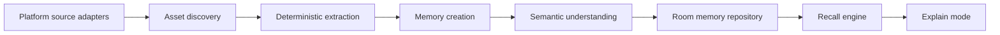

# Architecture

## Guiding principle

Android owns original files and source content. Memora owns only source references,
deterministic extraction, semantic memory records, and indexing state.

## Layers

### 1. Android platform adapters

Own permissions, MediaStore, Storage Access Framework, WorkManager, and provider SDKs
or APIs. They expose source capabilities and neutral Asset candidates only.

### 2. Domain

Owns `Asset`, `Memory`, indexing state, evidence, and ranking rules. It has no Android
framework imports and is unit-testable.

### 3. Data

Owns Room entities, source cursors, repositories, and cache policy. It persists data
needed for recovery and incremental re-indexing.

### 4. Application

Owns use cases: discover source, extract asset, create memory, index asset, search
memories, and explain result. WorkManager invokes these use cases in bounded batches.

### 5. UI

Compose screens render immutable state and send events to view models. UI does not
directly read files or call AI.

## Source adapter contract

Each adapter must declare:

- source ID and asset types it supports;
- required user approval and whether approval is still valid;
- stable source-specific identity for each asset;
- modified timestamp/version used for incremental work;
- whether content can be re-read after restart;
- error and revocation behavior.

Discovery returns a source-neutral Asset candidate. The pipeline must never assume
that a MediaStore URI, a document URI, and a provider note ID behave the same way.

## Indexing lifecycle

1. Discover a candidate.
2. Build or update its deterministic Asset identity.
3. Skip unchanged assets using source identity plus version/fingerprint.
4. Extract deterministic facts.
5. Create a placeholder Memory record with recoverable indexing status.
6. Run semantic understanding in a bounded worker.
7. Validate structured output before replacing the placeholder with a searchable Memory.
8. Record evidence and diagnostics so the result can be explained and failures retried.

## Safety boundaries

- Source adapters are read-only.
- AI receives the minimum necessary extracted content, only after the product's data
  handling policy is implemented.
- API credentials and provider secrets are never in the Android app.
- Failed work is retryable and idempotent; duplicate discovery does not create
  duplicate memories.
